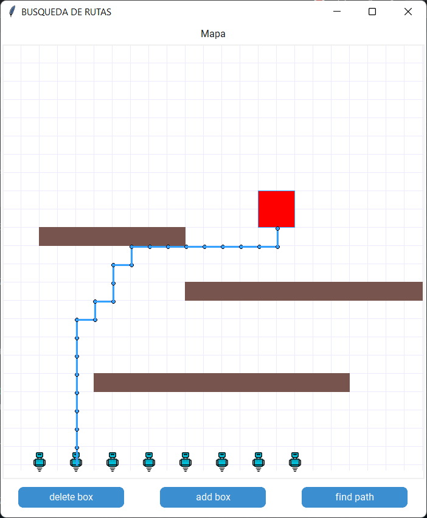

# Tkinter Path finder
[](https://forthebadge.com) [![forthebadge](data:image/svg+xml;base64,PHN2ZyB4bWxucz0iaHR0cDovL3d3dy53My5vcmcvMjAwMC9zdmciIHdpZHRoPSIyMTQuODEiIGhlaWdodD0iMzUiIHZpZXdCb3g9IjAgMCAyMTQuODEgMzUiPjxyZWN0IGNsYXNzPSJzdmdfX3JlY3QiIHg9IjAiIHk9IjAiIHdpZHRoPSIxMTUuMzEiIGhlaWdodD0iMzUiIGZpbGw9IiMzMUM0RjMiLz48cmVjdCBjbGFzcz0ic3ZnX19yZWN0IiB4PSIxMTMuMzEiIHk9IjAiIHdpZHRoPSIxMDEuNTAwMDAwMDAwMDAwMDEiIGhlaWdodD0iMzUiIGZpbGw9IiMzODlBRDUiLz48cGF0aCBjbGFzcz0ic3ZnX190ZXh0IiBkPSJNMTUuNjkgMjJMMTQuMjIgMjJMMTQuMjIgMTMuNDdMMTYuMTQgMTMuNDdMMTguNjAgMjAuMDFMMjEuMDYgMTMuNDdMMjIuOTcgMTMuNDdMMjIuOTcgMjJMMjEuNDkgMjJMMjEuNDkgMTkuMTlMMjEuNjQgMTUuNDNMMTkuMTIgMjJMMTguMDYgMjJMMTUuNTUgMTUuNDNMMTUuNjkgMTkuMTlMMTUuNjkgMjJaTTI4LjQ5IDIyTDI2Ljk1IDIyTDMwLjE3IDEzLjQ3TDMxLjUwIDEzLjQ3TDM0LjczIDIyTDMzLjE4IDIyTDMyLjQ5IDIwLjAxTDI5LjE4IDIwLjAxTDI4LjQ5IDIyWk0zMC44MyAxNS4yOEwyOS42MCAxOC44MkwzMi4wNyAxOC44MkwzMC44MyAxNS4yOFpNNDEuMTQgMjJMMzguNjkgMjJMMzguNjkgMTMuNDdMNDEuMjEgMTMuNDdRNDIuMzQgMTMuNDcgNDMuMjEgMTMuOTdRNDQuMDkgMTQuNDggNDQuNTcgMTUuNDBRNDUuMDUgMTYuMzMgNDUuMDUgMTcuNTJMNDUuMDUgMTcuNTJMNDUuMDUgMTcuOTVRNDUuMDUgMTkuMTYgNDQuNTcgMjAuMDhRNDQuMDggMjEuMDAgNDMuMTkgMjEuNTBRNDIuMzAgMjIgNDEuMTQgMjJMNDEuMTQgMjJaTTQwLjE3IDE0LjY2TDQwLjE3IDIwLjgyTDQxLjE0IDIwLjgyUTQyLjMwIDIwLjgyIDQyLjkzIDIwLjA5UTQzLjU1IDE5LjM2IDQzLjU2IDE3Ljk5TDQzLjU2IDE3Ljk5TDQzLjU2IDE3LjUyUTQzLjU2IDE2LjEzIDQyLjk2IDE1LjQwUTQyLjM1IDE0LjY2IDQxLjIxIDE0LjY2TDQxLjIxIDE0LjY2TDQwLjE3IDE0LjY2Wk01NS4wOSAyMkw0OS41MSAyMkw0OS41MSAxMy40N0w1NS4wNSAxMy40N0w1NS4wNSAxNC42Nkw1MS4wMCAxNC42Nkw1MS4wMCAxNy4wMkw1NC41MCAxNy4wMkw1NC41MCAxOC4xOUw1MS4wMCAxOC4xOUw1MS4wMCAyMC44Mkw1NS4wOSAyMC44Mkw1NS4wOSAyMlpNNjYuNjUgMjJMNjQuNjggMTMuNDdMNjYuMTUgMTMuNDdMNjcuNDcgMTkuODhMNjkuMTAgMTMuNDdMNzAuMzQgMTMuNDdMNzEuOTYgMTkuODlMNzMuMjcgMTMuNDdMNzQuNzQgMTMuNDdMNzIuNzcgMjJMNzEuMzUgMjJMNjkuNzMgMTUuNzdMNjguMDcgMjJMNjYuNjUgMjJaTTgwLjM4IDIyTDc4LjkwIDIyTDc4LjkwIDEzLjQ3TDgwLjM4IDEzLjQ3TDgwLjM4IDIyWk04Ni44NyAxNC42Nkw4NC4yMyAxNC42Nkw4NC4yMyAxMy40N0w5MS4wMCAxMy40N0w5MS4wMCAxNC42Nkw4OC4zNCAxNC42Nkw4OC4zNCAyMkw4Ni44NyAyMkw4Ni44NyAxNC42NlpNOTYuMjQgMjJMOTQuNzUgMjJMOTQuNzUgMTMuNDdMOTYuMjQgMTMuNDdMOTYuMjQgMTcuMDJMMTAwLjA1IDE3LjAyTDEwMC4wNSAxMy40N0wxMDEuNTMgMTMuNDdMMTAxLjUzIDIyTDEwMC4wNSAyMkwxMDAuMDUgMTguMjFMOTYuMjQgMTguMjFMOTYuMjQgMjJaIiBmaWxsPSIjRkZGRkZGIi8+PHBhdGggY2xhc3M9InN2Z19fdGV4dCIgZD0iTTEyOS4yOSAxNS40OEwxMjYuNzEgMTUuNDhMMTI2LjcxIDEzLjYwTDEzNC4yMyAxMy42MEwxMzQuMjMgMTUuNDhMMTMxLjY2IDE1LjQ4TDEzMS42NiAyMkwxMjkuMjkgMjJMMTI5LjI5IDE1LjQ4Wk0xNDAuOTYgMjJMMTM4LjYwIDIyTDEzOC42MCAxMy42MEwxNDAuOTYgMTMuNjBMMTQwLjk2IDE3LjA5TDE0NC4yMSAxMy42MEwxNDYuODIgMTMuNjBMMTQzLjM5IDE3LjMyTDE0Ny4wMCAyMkwxNDQuMjQgMjJMMTQxLjg0IDE4Ljk1TDE0MC45NiAxOS45MEwxNDAuOTYgMjJaTTE1My40OSAyMkwxNTEuMTEgMjJMMTUxLjExIDEzLjYwTDE1My40OSAxMy42MEwxNTMuNDkgMjJaTTE2MS4wMCAyMkwxNTguNjYgMjJMMTU4LjY2IDEzLjYwTDE2MC42MiAxMy42MEwxNjQuMzMgMTguMDdMMTY0LjMzIDEzLjYwTDE2Ni42NiAxMy42MEwxNjYuNjYgMjJMMTY0LjcwIDIyTDE2MS4wMCAxNy41MkwxNjEuMDAgMjJaTTE3My42MSAxNS40OEwxNzEuMDMgMTUuNDhMMTcxLjAzIDEzLjYwTDE3OC41NSAxMy42MEwxNzguNTUgMTUuNDhMMTc1Ljk4IDE1LjQ4TDE3NS45OCAyMkwxNzMuNjEgMjJMMTczLjYxIDE1LjQ4Wk0xODkuNjcgMjJMMTgyLjkyIDIyTDE4Mi45MiAxMy42MEwxODkuNTEgMTMuNjBMMTg5LjUxIDE1LjQ0TDE4NS4yOCAxNS40NEwxODUuMjggMTYuODVMMTg5LjAxIDE2Ljg1TDE4OS4wMSAxOC42M0wxODUuMjggMTguNjNMMTg1LjI4IDIwLjE3TDE4OS42NyAyMC4xN0wxODkuNjcgMjJaTTE5Ni44NSAyMkwxOTQuNDcgMjJMMTk0LjQ3IDEzLjYwTDE5OC4zMSAxMy42MFExOTkuNDYgMTMuNjAgMjAwLjI5IDEzLjk4UTIwMS4xMyAxNC4zNSAyMDEuNTkgMTUuMDZRMjAyLjA1IDE1Ljc2IDIwMi4wNSAxNi43MUwyMDIuMDUgMTYuNzFRMjAyLjA1IDE3LjYyIDIwMS42MiAxOC4zMFEyMDEuMTkgMTguOTggMjAwLjQwIDE5LjM2TDIwMC40MCAxOS4zNkwyMDIuMjEgMjJMMTk5LjY3IDIyTDE5OC4xNCAxOS43N0wxOTYuODUgMTkuNzdMMTk2Ljg1IDIyWk0xOTYuODUgMTUuNDdMMTk2Ljg1IDE3LjkzTDE5OC4xNyAxNy45M1ExOTguOTAgMTcuOTMgMTk5LjI3IDE3LjYxUTE5OS42NCAxNy4yOSAxOTkuNjQgMTYuNzFMMTk5LjY0IDE2LjcxUTE5OS42NCAxNi4xMiAxOTkuMjcgMTUuNzlRMTk4LjkwIDE1LjQ3IDE5OC4xNyAxNS40N0wxOTguMTcgMTUuNDdMMTk2Ljg1IDE1LjQ3WiIgZmlsbD0iI0ZGRkZGRiIgeD0iMTI2LjMxIi8+PC9zdmc+)](https://forthebadge.com)


## Installation
---
Use the package manager [pip](https://pip.pypa.io/en/stable/) to install the required packages.

```bash
    pip install -r requirements.txt
```

Run the app

```bash
   python UI.py
```
## Screenshot
---

<div style="text-align:center">
  
</div>